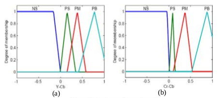
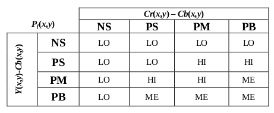
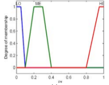

# Pixel-Wise Fire Detection based on Fuzzy Inference System

This repo is an implementation of Pixel-Wise Fire Detection method which is based on Fuzzy Inference System.
<p align="center">
  
</p>
## **Approach:**
 ### WorkFlow of Fire Detection
* **RGB2YCrCb** Convert image to YCrCb Color Space.
* **Fuzzify input:** feed $Y - Cb$ and $Cr - Cb$
  
* **Apply rule table**
  
* **Defuzzify output:** output the probability
  
* **Reference:**
  This implementation is based on the method described blow, but the different rule table and implication operator are used.
  ```
  Çelik T, Özkaramanlı H, Demirel H. Fire and smoke detection without sensors: Image processing based approach[C]//2007 15th European Signal Processing Conference. IEEE, 2007: 1794-1798.
  ```
## **Demo**

  ```
  mkdir build
  cmake ..
  make
  ./fireDetection 'i' /path/to/image
  ```